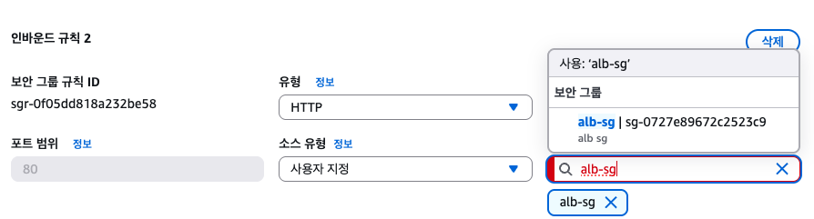

# ALB

## ALB(Application Load Balancer)
- HTTP/HTTPS(웹) 를 처리하는 로드 밸런서
- HTTP, URL, Header,Cookie까지 읽을 수 있음. -> 그래서 Application 로드 밸런서임
- "사용자와 ec2 사이에서 트래픽을 대신 받아주는 문지기"
   -> 사용자는 ec2에 직접 접근하지 않음.
- ALB가 public에서 트래픽을 받아 private에 있는 ec2로 전달
  -> ec2는 보안을 위해 private에 있어야 하고, private ip만 가지고 있어야함.

```bash
                Internet
                    │
                    │
             Internet Gateway
                    │
         ┌──────────┴──────────┐
         │                     │
  Public Subnet A      Public Subnet C
         │                     │
      ALB Node             ALB Node
         │                     │
────────────── VPC 내부 통신 ──────────────
         │                     │
 Private Subnet A      Private Subnet C
         │                     │
       EC2-1                  EC2-2
```
### ALB의 Target group
- alb는 ec2를 직접 등록하지 않음. alb는 target group만 알고 있다고 보면 됨.
  즉 target group이 ec2를 관리하는 것. 그래야 ec2가 바뀔때마다 alb를 계속 수정하는걸 막을 수 있음.
- target group에는 ec2의 private ip로 등록됨.
```bash
Target Group

EC2-1
10.0.2.10 (private ip)

EC2-2
10.0.2.11 (private ip)

EC2-3
10.0.2.12 (private ip)
```

### ALB health check
- ec2가 살아있는지 검사하는게 아니라 애플리케이션이 정상적으로 서비스 제공하는지 검사
```bash
      Health Check는 
EC2 stop, runnging을 보는게 아님
           ↓
       Port 정상 확인
           ↓
   Application 응답 확인
           ↓
    Response Code 확인
```
- alb는 주기적으로 요청을 보내 서버가 정상인지 확인함.
  정상이면 트래픽을 계속 보내고, 그게 아니면 더이상 요청을 보내지 않음.

### ALB 고가용성
ALB를 생성할 때 서로 다른 zone의 subnet을 선택하라고 나옴.
ec2는 1개만 있어도 상관없지만, subnet은 2개 이상 있어야함.

ALB는 aws 내부에서 여러개의 alb node가 여러 az에 분산되어 동작함.
콘솔에서 1개 만드는 것처럼 보여도, 실제로는 aws가 여러 az에 여러 alb node를 자동으로 배치
-> 고가용성을 기본으로 하고 있기 때문에 반드시 2개 이상 필요!

## 경로기반 라우팅
url별로 각각 다른곳으로 트랜잭션을 보내는것.
alb는 Url을 읽을 수 있음!!

```bash
# http://example.com/api/users로 호출
# alb에서 host : example.com, path : /api/users 라고 읽음.
# /api target group으로 호출 보내자!가 가능 -> L7(Application Layer) 기능
                 ALB
                  │
     ┌────────────┼─────────────┐
     │            │             │
     ▼            ▼             ▼
    /           /api         /admin
   │             │              │
 TG-Web        TG-API      TG-Admin
```

## ALB 실습!

```bash
                   Internet
                        │
                 Internet Gateway
                        │
        ┌───────────────┴───────────────┐
        │                               │
   Public Subnet A                 Public Subnet C
        │                               │
        └────────── ALB ────────────────┘
                  (alb-sg)
                        │
                 Target Group
                 Health Check
                  (GET /)
               ┌────────────┐
               │            │
        Private EC2-1   Private EC2-2
          (web-sg)        (web-sg)
               ▲
               │ SSH
               │
         Bastion Host
```

### 1. ALB 전용 보안그룹 생성
ALB에 붙여줄 보안그룹 생성하기
인터넷 누구나 alb로 들어올 수 있게 생성
| 유형   | 포트 | 소스        |
| ---- | -- | --------- |
| HTTP | 80 | 0.0.0.0/0 |


### 2. ALB 보안그룹을 source로 가지고 있는 보안그룹 생성하여 ec2 보안그룹으로 설정
ALB를 통한 요청만 ec2에 들어올 수 있도록 sorce에 alb sg를 설정한 web sg 보안그룹 생성
이렇게 생성하면 web sg는 alb sg만 허용하게 됨
| 유형   | 포트 | 소스     |
| ---- | -- | ------ |
| HTTP | 80 | alb-sg |

<p align="left">
  
</p>

### 3. private ec2 두대에 nginx 설치
3-1. SSH Agent Forwarding 사용해서 bastion host 서버에 접속
- 서버 접속을 위해서는 private ec2 sg에 bastion ssh가 뚫려있어야 가능
```bash
# ssh-add 등록 및 확인
ssh-add ~/.ssh/my-key.pem
ssh-add -ㅣ

# SSH Agent Forwarding 사용
ssh -A -i my-key.pem ubuntu@bation host ip

# private ec2 접속
ssh ubuntu@Private EC2의 Private IP
```

3-2. nginx 설치 후 html 문구 변경
- private ec2 내부에서 nginx 설치하기 위해서는 nat 설정이 되어있어야함.
```bash
# nginx 설치
# private subnet route에 nat가 추가되어있어야 가능
sudo apt update
sudo apt install nginx -y
sudo systemctl status nginx

# ec2별로 html 문구 변경
# tee : 입력받은 내용을 화면에도 출력하고 파일에도 저장하는 명령어
echo "Hello from Server 1" | sudo tee /var/www/html/index.html
echo "Hello from Server 2" | sudo tee /var/www/html/index.html
```

### 4. target group 생성
http(80)에 대해 health check
```bash
Protocol : HTTP
Path : /
Port : traffic port (80)
```
### 5. ALB 생성
기존에 생성했던 alb sg의 target group 을 이용해 생성
생성 이후 dns name으로 접속해보면 Hello from Server 1, Hello from Server 2가 왔다갔다 하면서 뜸.
즉 alb가 ec1, ec2에게 트래픽을 자동으로 분산해가며 보내고 있는 것을 확인할 수 있음.

### 6. target group healthy check
ec2 2개 중 하나로 접속해서 nginx 서비스를 stop하면 target group에서 해당 ec2가 unhealthy뜸.
서버가 살아있지만, 그걸 체크하는는게 아니라 target group 생성할 때 지정한 조건에 맞게 체크함.
```bash
Protocol : HTTP
Path : /
Port : traffic port (80)
```
해당 기준으로 생성했다면, 80 port 사용 중인 nginx 서비스가 중단되어 응답이 없기 때문에 Unhealthy 상태가 되는것

## 경로기반 라우팅 실습

### 1. target group을 한개 더 생성
각각의 target group 에 ec2가 하나씩 들어가게 설정

### 2. alb에 규칙 추가
```bash
HTTP:80

Priority 1
IF Path = /api* -> 이거를 /api/*로 했다가 /api는 규칙 적용이 안되는 문제 발생. /api*로 하기..
      ↓
새 Target Group

Default
     ↓
기존 Target Group
```