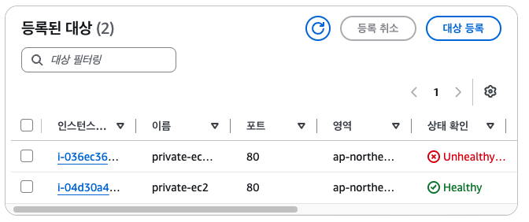
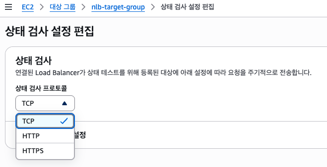

# NLB

## NLB(Network Load Balancer)
- TCP, UDP를 처리하는 로드밸런서
- NLB는 TCP Packet만 봄. api, host, header 등등 모르는 일임!!
- 그래서 target group에 TCP 연결만 되면 healthy 상태로 보여짐.
- 대신 ALB는 못하는 고정 IP를 가질 수 있음
- 주로 TCP 연결만 하면 되는 TCP기반 프로토콜인 곳에 사용
  mysql(3306), redis(6379), kafka(9092)..
- Internet-facing NLB : 외부 사용자가 접속 가능함
- Interal NLB : 인터넷에서 아예 접근이 안됨
```bash
    MySQL
    ↓
    NLB
    ↓
    DB 서버
``` 
## NLB 실습
Internet-facing NLB로 실습
### 1. NLB 생성 및 target group 생성
```bash
Listener : TCP 80
Target Group : 새로 생성
Type : Instances
Protocol : TCP
Port : 80
Health Check : TCP(기본값)
```
### 3. target group 중 한개의 ec2에서 nginx stop 한 뒤 healthy 체크하기
nginx 자체를 stop하면 80 포트에 있는 nginx에서 응답이 오지 않아 unhealthy 처리됨.
TCP 연결 자체가 불가하므로!

<p align="left">
  
</p>

### 4. nginx의 기본 응답값을 404로 return으로 변경한 뒤 healthy 체크하기
NLB는 TCP 연결만 확인할 수 있을뿐, 응답이 404/500/200인지 모름.
그렇기 때문에 연결만 성공하면 healthy !

- ALB : http 응답코드를 확인해서 헬스체크 확인
- NLB : TCP 연결 자체만 확인. 포트만 열려있으면 반환코드는 신경쓰지 않음.

하지만, nlb target group 일지라도 http/https로 healthy check 할수 있음.
nlb는 tcp만 처리하지만 healthy는 http/https로도 가능.
<p align="left">
  
</p>

