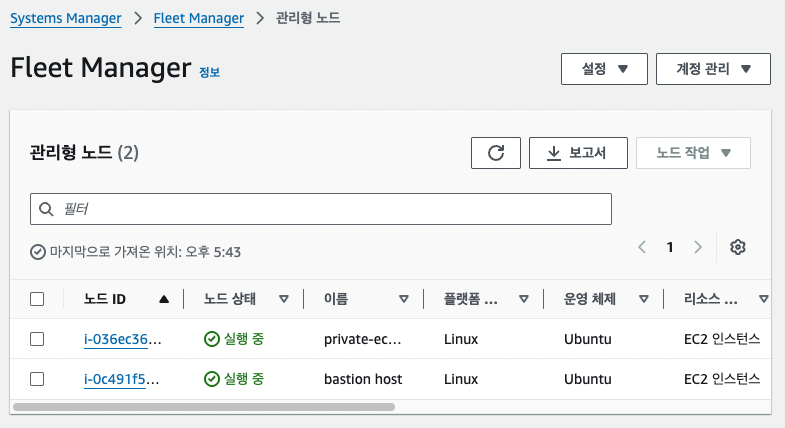

# SSM

## SSM(Systems Manager)이란?
AWS에서 EC2나 서버를 중앙에서 관리할 수 있도록 해주는 서비스

## 필요성
ec2로 접속할 때 SSM을 사용하면..
- ssh 키 필요 없음
- 22번 포트 필요 없음
- Public ip 없어도 됨
- bastion 서버 없어도됨
그래서 aws가 굉장히 권장하는 방식
```bash
   Mac
    ↓
AWS Console
    ↓
   SSM
    ↓
   EC2
```
이런 형태라 aws가 ec2안으로 들어오는거 같지만, 실제는 ec2가 aws ssm 서버에 주기적으로 계속 연결하는 것.
-> 그래서 ssm 사용시 필요 조건 2번에 인터넷 혹은 vpc endpoint가 들어감

## ssh와 비교
| SSH                | SSM           |
| ------------------ | ------------- |
| 22번 포트 필요          | 22번 포트 불필요    |
| Key Pair(.pem) 필요  | Key Pair 불필요  |
| 퍼블릭 IP가 필요한 경우가 많음 | 퍼블릭 IP 없이 가능  |
| 직접 접속              | AWS를 통해 접속    |
| 접속 기록 관리가 어려움      | 접속 기록을 남기기 쉬움 |


## SSM을 사용하려면 필요한 조건

### 1. IAM role
ssm 관련 role이 필요

### 2. SSM agent
ssm agent설치되어 있는지 확인하기
```bash
sudo systemctl status snap.amazon-ssm-agent.amazon-ssm-agent

sudo systemctl status amazon-ssm-agent
```

### 3. 인터넷 혹은 VPC endpoint
SSM은 ec2와 aws ssm 서비스가 통신해야됨.
즉! ec2가 aws ssm 서버로 나갈 수 있어야한다는 것.

3-1. public ip
public ip를 이용해 외부로 나가서 접근
```bash
    EC2
     ↓
Internet Gateway
     ↓
   인터넷
     ↓
AWS SSM 서버
```

3-2. NAT gateway
private 환경일 경우 NAT를 이용해 외부로 나가서 접근
```bash
Private EC2
    ↓
NAT Gateway
    ↓
Internet Gateway
    ↓
  인터넷
    ↓
AWS SSM 서버
```

3-3. VPC endpoint
결국은 ssm도 aws 서비스니까 굳이 인터넷을 안통해도 되지 않나??
-> 그래서 인터넷 없이 vpc endpoint로 가기
- endpoint : aws 서비스마다 vpc안에 전용 출입구 만들어주는것. 따라서 vpc 내부에 생성됨
    -> s3 endpoint, cloudwatch endpoint, ssm endpoint...
```bash
Private EC2
    ↓
VPC Endpoint(aws 내부망)
    ↓
AWS SSM
```

## 실습1 - Public ip, NAT
public ip가 있는 ec2에서 진행하거나, NAT가 연결되어 있는 private ec2에서 ssm role 추가 후 session manager로 ec2 접속하기
```bash
           AWS SSM Service
                  ▲
                  │
              Internet
                  ▲
          Internet Gateway
                  ▲
                  │
      Public EC2 (Public IP)
```

### 1. 기존 생성했던 role에 ssm 권한 추가하기
AmazonSSMManagedInstanceCore 권한 추가

### 2. SSM agent 설치 확인하기
```bash
sudo systemctl status snap.amazon-ssm-agent.amazon-ssm-agent

sudo systemctl status amazon-ssm-agent
```

### 3. Systems Manager 콘솔 확인
1. aws console에서 Systems Manager 들어가기
2. 플릿 매니저 들어가기
3. 관리형 노드에 서버가 보이면 ssm 등록 성공
   -> 플릿 매니저에 서버가 보이면 aws가 이 ec2는 내가 관리할 수 있는 서버라고 인식한 상태
<p align="left">
  
</p>

### 4. SSM 이용해서 서버 접속하기
플릿 매니저 화면에서 서버 클릭 후 노드 작업 -> 연결 -> 터미널 세션 시작


## 실습2 - vpc endpoint 
NAT가 없는 환경에서 private ec2를 ssm 이용해서 접속하기
NAT가 없으면 private ec2는 aws ssm을 연결하지 못해서 fleet manager에서도 ec2가 사라지고 ssm으로 접속할 수가 없게됨. 이때 vpc endpoint를 이용해서 접속해야함

### 1. endpoint 3개 생성
```bash
유형 : aws 서비스
   -> ssm(aws가 제공하는 서비스)에 연결하기 위함이기 때문에 이걸로 선택
리전 간 엔드포인트 : 비활성화
   -> 해당 기능은 현재 내 리전(서울)이 아닌 다른 리전(도쿄나 버지니아나 뭐..)에 연결하고 싶을때 사용하는 기능
서비스 : ✅ com.amazonaws.ap-northeast-2.ssm -> 명령 전달
       ✅ com.amazonaws.ap-northeast-2.ssmmessages -> 세션 메니저 터미널 통신
       ✅ com.amazonaws.ap-northeast-2.ec2messages -> ec2 에이전트와 ssm 서비스 통신
    -> 서비스는 endpoint 당 1개씩만 가능. 즉 endpoint 3개 생성 필요!!
프라이빗 dns 이름 : 활성화
  -> 체크해야 ec2가 인터넷 dns가 아니라 endpoint로 연결함
서브넷 : private ec2가 있는 private subnet을 선택
  -> interface endpoint는 선택한 서브넷마다 ENI를 하나씩 만듦.
보안그룹 : ssm endpoint용 보안그룹을 생성해서 선택
  -> 유형 : https(443), 소스 : ec2 보안 그룹
정책 : 전체 엑세스
```

### 2. ssm 이용해서 서버 접속하기
플릿 매니저 화면에서 서버 클릭 후 노드 작업 -> 연결 -> 터미널 세션 시작