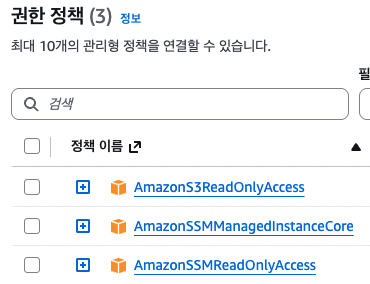

# SSM - Parameter Store 중심

## SM - Parameter Store란??
애플리케이션이나 서버가 사용하는 설정값(Config)이나 비밀번호, API Key 등을 안전하게 저장하는 공간

예전에는 서버 내부에 application.properties 파일이나 .env 파일을 넣곤 했는데 요즘은 "AWS Parameter Store + IAM 권한" 으로 관리!
```bash
EC2/ECS/EKS
    ↓
Parameter Store
    ↓
값 가져오기
```

### 필요성
웹 서버가 실행되기 위해서 DB 주소/계정/비밀번호, Kafka 주소 등등이 필요
코드에 해당 정보들을 넣으면 여러 서버에서 변경하기 어렵고 무엇보다 보안상 위험함.
그래서 외부에서 관리하는 저장소가 필요한 것!

### 구조
트리 구조처럼 관리함.
```bash
/prod/db/host
/prod/db/user
/prod/db/password

/prod/api/jwt-secret

/prod/redis/host

/dev/db/password
```

### 유형
1. 문자열(String) : 평문 저장
2. 문자열 목록(StringList) : 쉼표로 구분된 목록. 생각보다 잘 안쓴다고 함
3. 보안 문자열(SecureString) : 평문저장하면 안되는 비밀번호나 키 값 같은 정보를 KMS 암호화해서 저장

| Parameter Store | Secrets Manager |
| --------------- | --------------- |
| 설정값 저장          | 비밀번호/Secret 저장  |
| 무료(Standard)    | 유료              |
| 자동 비밀번호 교체 X    | 자동 Rotation O   |
| KMS 사용 가능       | KMS 기본 사용       |
| DB, Redis host, kafka broker| DB password, API key, JWT secret |


## 실습1 - String
먼저 간단한 실습으로 "문자열(String)" 유형 파라미터로 실습
```bash
Parameter Store
    ↓
IAM Role 권한
    ↓
EC2(AWS CLI)
    ↓
Parameter 조회
```

1. 파라미터 생성
   SSM -> 애플리케이션 도우 -> 파라미터 스토어 -> 파라미터 생성
```bash
이름 : /study/db/password
   -> "/"로 계층 구조를 만들어야함.
계층 : 표준
유형 : 문자열
데이터 형식 : text
값 : abcd1234(비밀번호로 쓸 값 입력)
```

2. role에 권한 추가
AmazonSSMManagedInstanceCore 권한에는 Parameter Store 읽기 권한이 없어서 추가해야함.
SSM 실습 때 만들었떤 IAM role에 해당 권한 추가하기
```bash
AmazonSSMReadOnlyAccess
```
<p align="left">
  
</p>

3. ec2에서 Parameter 조회
```bash
# 조회
aws ssm get-parameter \
--name "/study/db/password"

# 결과
{
    "Parameter": {
        "Name": "/study/db/password",
        "Type": "String",
        "Value": "abcd1234",
        "Version": 1,
        "LastModifiedDate": "2026-07-24T08:17:20.074000+00:00",
        "ARN": "arn:aws:ssm:ap-northeast-2:xxxxxx:parameter/study/db/password",
        "DataType": "text"
    }
}

## 값만 깔끔하게 조회
aws ssm get-parameter \
--name "/study/db/password" \
--query "Parameter.Value" \
--output text

# 결과
abcd1234
```

## 실습2 - SecureString
보안 문자열(SecureString) 유형 파라미터 생성 후 조회하기

1. 파라미터 생성
   SSM -> 애플리케이션 도우 -> 파라미터 스토어 -> 파라미터 생성
```bash
이름 : /study/db/password-secure
   -> "/"로 계층 구조를 만들어야함.
계층 : 표준
유형 : 보안 문자열
데이터 형식 : text
값 : abcd1234(비밀번호로 쓸 값 입력)
```

2. ec2에서 Parameter 조회
보안 문자열은 일반적으로 조회하면 암호화된채로 보여짐
```bash
# 조회
aws ssm get-parameter \
--name "/study/db/password-secure"

# 결과
{
    "Parameter": {
        "Name": "/study/db/password-secure",
        "Type": "SecureString",
        "Value": "AQICAHjjaSgKdAwy4r6Vpg0T4D2QrpuWWaJrefokCxXYc/zL1AG7vbiJEZ1gBFGlOoIDGWhUAAAAZjBkBgkqhkiG9w0BBwagVzBVAgEAMFAGCSqGSIb3DQEHATAeBglghkgBZQMEAS4wEQQMK2wdJH/X2iGqMIx+AgEQgCOHyfjO0yOjuLNWUAkYD6l7GcILnDSKyZquy3di59xXFT2vsQ==",
        "Version": 1,
        "LastModifiedDate": "2026-07-24T09:06:04.769000+00:00",
        "ARN": "arn:aws:ssm:ap-northeast-2:245067526307:parameter/study/db/password-secure",
        "DataType": "text"
    }
}

# 복호하해서 조회
aws ssm get-parameter \
--name "/study/db/password-secure" \
--with-decryption

# 결과
{
    "Parameter": {
        "Name": "/study/db/password-secure",
        "Type": "SecureString",
        "Value": "abcd1234",
        "Version": 1,
        "LastModifiedDate": "2026-07-24T09:06:04.769000+00:00",
        "ARN": "arn:aws:ssm:ap-northeast-2:245067526307:parameter/study/db/password-secure",
        "DataType": "text"
    }
}
```
