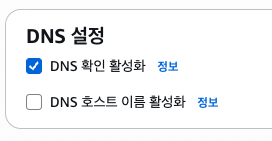
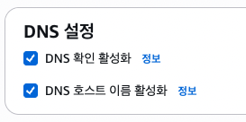

# SSM 테스트하면서 발생한 문제들

## 1. vpc endpoint 생성 중 장애 발생

### 장애 현상
vpc endpoint 생성 도중 아래와 같은 장애 발생
```bash
Enabling private DNS requires both enableDnsSupport and enableDnsHostnames VPC attributes set to true for vpc-id
```

### 장애 원인
Private DNS를 사용하려면 VPC 자체에서 DNS 기능이 켜져 있어야 하는데, 현재 VPC는 DNS 설정이 꺼져 있어서 발생한 장애

```bash
# vpc dns 옵션
# 두 개 모두 true여야함
VPC
 ├─ enableDnsSupport
 └─ enableDnsHostnames
```
현재 dns 설정 중에서 "dns 호스트 이름 활성화"가 꺼져있어서 장애 발생
<p align="left">
  
</p>

### 장애 해결
vpc dns 설정을 두 개 전부 체크하면 Endpoint 정상적으로 생성 완료

<p align="left">
  
</p>


## 2. vpc endpoint 생성 후 session manager로 접속하려할 때 장애

### 장애 현상
vpc endpoint를 모두 설정 후 session manager로 private ec2 접속을 하려고 하는데 장애발생

1. endpoint 상태 모두정상
2. endpoint가 있는 서브넷이 private ec2가 있는 서브넷이 맞음
3. endpoint의 보안그룹 inbound 정상
```bash
유형 : HTTPS 443
소스 : private ec2가 가지고 있는 보안그룹
```
4. ssm dns 조회했을 때 사설 Ip가 나옴
    -> private dns가 제대로 적용된 상태
```bash
# 서버가 ssm 서비스 도메인 이름을 ip주소로 변환할 수 있는지 확인하는 명령어
nslookup ssm.ap-northeast-2.amazonaws.com
nslookup ec2messages.ap-northeast-2.amazonaws.com
nslookup ssmmessages.ap-northeast-2.amazonaws.com
```

5. ssm agent log 확인
```bash
sudo tail -100 /var/log/amazon/ssm/amazon-ssm-agent.log

# 에러 
2026-07-23 09:10:52.3212 ERROR [ssm-agent-worker] [MessageService] [Association] Unable to load instance associations, unable to retrieve associations unable to retrieve associations RequestError: send request failed caused by: Post "https://ssm.ap-northeast-2.amazonaws.com/": dial tcp 43.xxx.xx.xx:443: i/o timeout
```

### 장애 원인
에러 로그에 있던 "43.xxx.xx.xx"은 공인 IP. endpoint 테스트하기 전 NAT를 이용해 먼저 테스트 진행했을 때 설정이 남아있던 것.

DNS는 endpoint를 바라보고 있는데 ssm agent는 아직 기존 연결이었던 NAT로 연결되어 있어서 장애 발생
```bash
# ssm agent 실행될 때
DNS 조회
    ↓
세션 생성
    ↓
AWS와 연결 유지
```

### 장애 해결
ssm agent를 재시작해서 dns를 다시 조회하게 하면 정상적으로 endpoint를 바라봐서 session manager로 정상 접속됨.
```bash
# 재시작
sudo systemctl restart snap.amazon-ssm-agent.amazon-ssm-agent
```